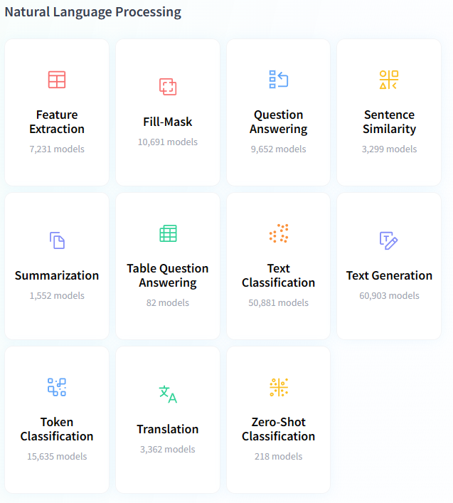

contribution: 
https://carpentries-incubator.github.io/python-text-analysis/
# NLP Pipline

Text Analysis, also known as Natural Language Processing or NLP, is a subdiscipline of the larger disciplines of machine learning and artificial intelligence.

AI and machine learning both use complex mathematical constructs called models to take data as an input and produce a desired output.

What distinguishes NLP from other types of machine learning is that text and human language is the main input for NLP tasks.

# What tasks can NLP do?
There are many models for representing language. The model we chose for our task will depend on what we want the output of our model to do. In other words, our model will vary based on the task we want it to accomplish.

We can think of the various tasks NLP can do as different types of desired outputs, which may require different models depending on the task.

Let’s discuss tasks you may find interesting in more detail. These are not the only tasks NLP can accomplish, but they are frequently of interest for Humanities scholars.

### Search
Search attempts to retrieve documents that are similar to a query. In order to do this, there must be some way to compute the similarity between documents. A search query can be thought of as a small input document, and the outputs could be a score of relevant documents stored in the corpus. While we may not be building a search engine, we will find that similarity metrics such as those used in search are important to understanding NLP.

### Topic Modeling
Topic modeling is a type of analysis that attempts to categorize documents into categories. These categories could be human generated labels, or we could ask our model to group together similar texts and create its own labels. For example, the Federalist Papers are a set of 85 essays written by three American Founding Fathers- Alexander Hamilton, James Madison and John Jay. These papers were written under pseudonyms, but many of the papers authors were later identified. One use for topic modelling might be to present a set of papers from each author that are known, and ask our model to label the federalist papers whose authorship is in dispute.

Alternatively, the computer might be asked to come up with a set number of topics, and create categories without precoded documents, in a process called unsupervised learning. Supervised learning requires human labelling and intervention, where unsupervised learning does not. Scholars may then look at the categories created by the NLP model and try to interpret them. One example of this is Mining the Dispatch, which tries to categorize articles based on unsupervised learning topics.

### Token Classification
The task of token classification is trying to apply labels on a more granular level- labelling words as belonging to a certain group. The entities we are looking to recognize may be common. Parts of Speech (POS) Tagging looks to give labels to entities such as verbs, nouns, and so on. Named Entity Recognition (NER) seeks to label things such as places, names of individuals, or countries might not be easily enumerated. A possible application of this would be to track co-occurrence of characters in different chapters in a book.

### Document Summarization
Document summarization takes documents which are longer, and attempts to output a document with the same meaning by finding relevant snippets or by generating a smaller document that conveys the meaning of the first document. Think of this as taking a large set of input data of words and outputting a smaller output of words that describe our original text.

### Text Prediction
Text prediction attempts to predict future text inputs from a user based on previous text inputs. Predictive text is used in search engines and also on smartphones to help correct inputs and speed up the process of text input. It is also used in popular models such as ChatGPT.

# Worked Example: Chatbot in Python
We’ve got an overview of what different tasks we can accomplish. Now let’s try getting started with doing these tasks in Python. We won’t worry too much about how this model works for the time being, but will instead just focusing trying it out. We’ll start by running a chatbot, just like the one we used online.

NLP tasks often need to be broken down into simpler subtasks to be executed in a particular order. These are called **pipelines** since the output from one subtask is used as the input to the next subtask. We will now define a “pipeline” in Python.

01. Text Embeddings
02. Word Embeddings
